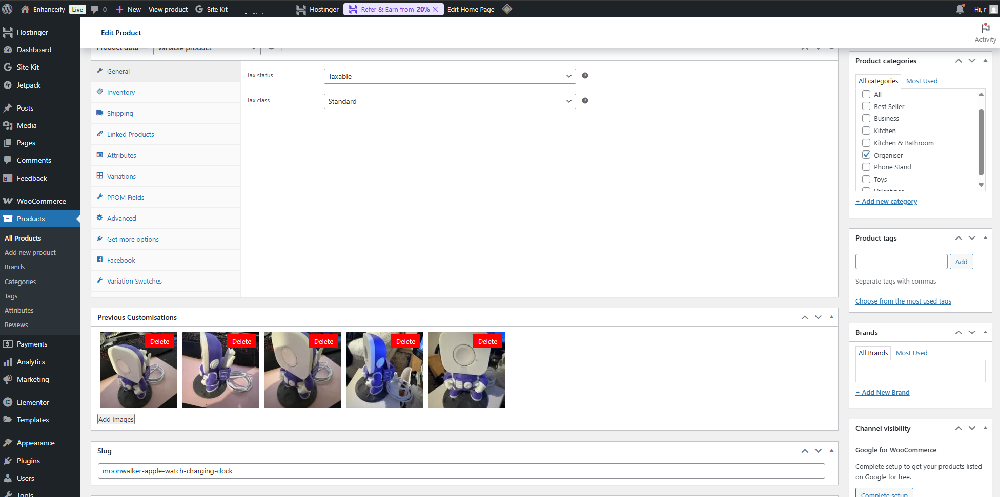
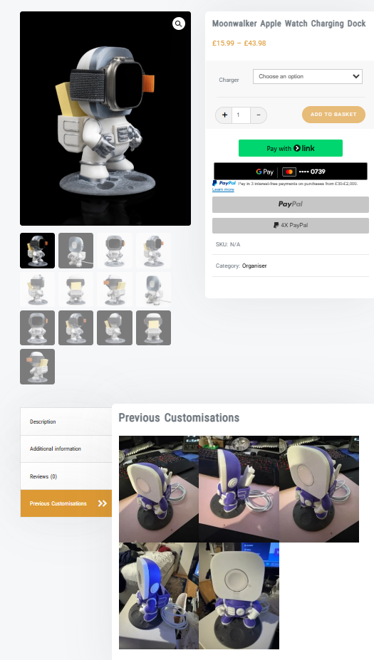

# Previous Customisation Highlights

Previous Customisation Highlights is a WordPress plugin that adds a "Previous Customisations" tab to WooCommerce product pages. This tab allows store owners to showcase previous customisations made for other customers by uploading images. The plugin includes features to easily add, display, and remove images through the WordPress admin panel.

## Features

- Adds a "Previous Customisations" tab to WooCommerce product pages.
- Allows store owners to upload images from the WordPress media gallery.
- Displays uploaded images in a gallery format on the product page.
- Includes functionality to remove previously added images.
- Admin-only delete buttons to ensure customers can't remove images.

## Installation

1. Download the plugin files and upload them to the `/wp-content/plugins/` directory.
2. Activate the plugin through the "Plugins" menu in WordPress.
3. Edit a product and use the meta box to add images to the "Previous Customisations" section.

## Usage

1. Go to the WordPress admin panel and navigate to "Products."
2. Edit the product you want to add customisation images to.
3. In the "Previous Customisations" meta box, click "Add Images" to select images from the media gallery.
4. The selected images will be displayed in the meta box. You can remove images by clicking the "Delete" button.
5. Save the product to update the customisation images.
6. The "Previous Customisations" tab will be visible on the product page, showing the uploaded images.

## Screenshots

- **Admin Panel:** Adding images to the "Previous Customisations" section.
  

- **Product Page:** Viewing the "Previous Customisations" tab.
  

## Contributing

1. Fork the repository.
2. Create a new branch (`git checkout -b feature-branch`).
3. Commit your changes (`git commit -m 'Add some feature'`).
4. Push to the branch (`git push origin feature-branch`).
5. Open a pull request.

